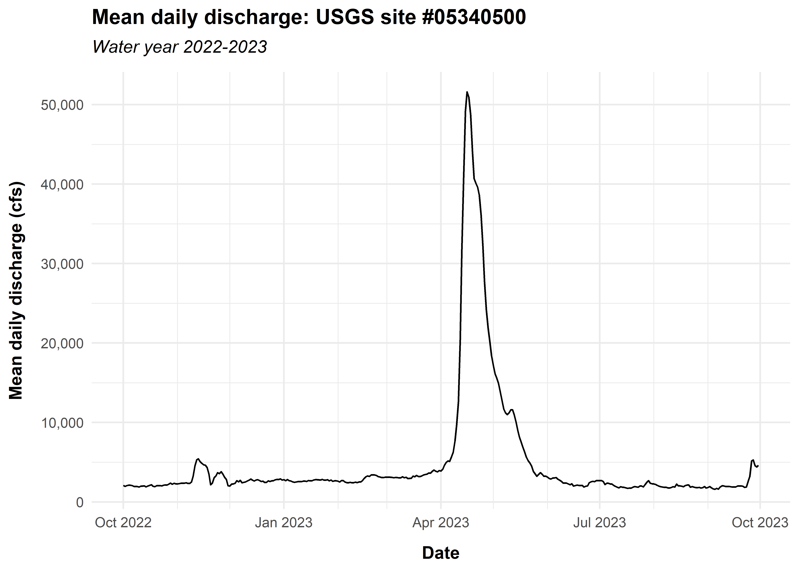

# `dataRetrieval` user package testing


## Introduction

This script is part of user testing for the United States Geological
Survey [dataRetrieval](https://doi-usgs.github.io/dataRetrieval/) R
package. As part of user testing, users are asked to conduct an analysis
that addresses this prompt:

*You are working on an annual report of discharge and water temperature
at the* *Milwaukee River near Cedarburg, Wisconsin, site
\#USGS-04086600. Your tasks* *are: a) download the daily data for stream
discharge and water temperature* *between Oct 1, 2022 and Sept 30, 2023;
b) create time-series plots of the* *data, one for each variable.*

``` r
site <- "04086600"

start_date <- lubridate::as_date(x = "2022-10-01")
end_date <- lubridate::as_date(x = "2023-09-30")
```

## Data exploration

I started by exploring the parameter and statistic codes that are
relevant to this prompt. To retrieve relevant parameter codes, I:

- visited `readNWISdv()` [function
  documentation](https://doi-usgs.github.io/dataRetrieval/reference/readNWISdv.html)
- clicked the link provided for [daily value
  documentation](https://waterservices.usgs.gov/docs/dv-service/daily-values-service-details)
  and navigated to the section that addresses parameter codes
- clicked the link provided for the [parameter codes
  list](https://help.waterdata.usgs.gov/codes-and-parameters/parameters)
- clicked the link provided for the [html page of physical parameter
  codes](https://help.waterdata.usgs.gov/parameter_code?group_cd=PHY)

I then extracted a list of all parameter codes associated with discharge
and water temperature that I might use to answer this prompt.

``` r
parameter_codes <- tibble::tribble(
  ~parameter_code, ~description,
  "00010",         "Temperature, water, degrees Celsius",
  "00011",         "Temperature, water, degrees Fahrenheit",
  "00060",         "Discharge, cubic feet per second, mean, 1 day",
  "00061",         "Discharge, instantaneous, cubic feet per second",
  "30208",         "Discharge, cubic meters per second, mean, 1 day",
  "30209",         "Discharge, instantaneous, cubic meters per second",
  "50042",         "Discharge, gallons per minute",
  "72243",         "Discharge, cubic feet per day"
)
```

Next, I called `whatNWISdata()` to explore the parameters available for
the specified site and filtered the returned dataframe to retain only
those observations with parameter codes of interest.

``` r
available_data <- dataRetrieval::whatNWISdata(siteNumber = site)

available_data <- available_data |>
  dplyr::select(site_no, data_type_cd, parm_cd, stat_cd, begin_date, end_date, count_nu) |>
  dplyr::filter(parm_cd %in% parameter_codes$parameter_code) |>
  dplyr::left_join(parameter_codes, by = c("parm_cd" = "parameter_code"))

knitr::kable(available_data, format = "pipe")
```

| site_no | data_type_cd | parm_cd | stat_cd | begin_date | end_date | count_nu | description |
|:---|:---|:---|:---|:---|:---|---:|:---|
| 04086600 | dv | 00060 | 00003 | 1981-11-01 | 2025-02-11 | 15809 | Discharge, cubic feet per second, mean, 1 day |
| 04086600 | qw | 00010 | NA | 2007-09-18 | 2019-09-06 | 9 | Temperature, water, degrees Celsius |
| 04086600 | qw | 00010 | NA | 2008-07-23 | 2009-09-04 | 2 | Temperature, water, degrees Celsius |
| 04086600 | qw | 00010 | NA | 1981-11-18 | 2018-06-12 | 90 | Temperature, water, degrees Celsius |
| 04086600 | qw | 00060 | NA | 1993-09-14 | 2008-12-22 | 13 | Discharge, cubic feet per second, mean, 1 day |
| 04086600 | qw | 00061 | NA | 2007-09-18 | 2013-08-19 | 4 | Discharge, instantaneous, cubic feet per second |
| 04086600 | qw | 00061 | NA | 1981-11-18 | 2009-07-21 | 200 | Discharge, instantaneous, cubic feet per second |
| 04086600 | qw | 30208 | NA | 1993-09-14 | 2008-12-22 | 13 | Discharge, cubic meters per second, mean, 1 day |
| 04086600 | qw | 30209 | NA | 2007-09-18 | 2013-08-19 | 4 | Discharge, instantaneous, cubic meters per second |
| 04086600 | qw | 30209 | NA | 1981-11-18 | 2009-07-21 | 200 | Discharge, instantaneous, cubic meters per second |
| 04086600 | uv | 00060 | NA | 1986-10-01 | 2025-02-12 | 14014 | Discharge, cubic feet per second, mean, 1 day |

Looking at this dataframe of available data, it appears that water
temperature data are not available for the period of interest (water
year 2022-2023). To confirm that I have not excluded important parameter
codes or have otherwise interpreted information incorrectly, I viewed
the [station
information](https://waterdata.usgs.gov/nwis/inventory/?site_no=04086600&agency_cd=USGS&)
in the NWIS graphical user web interface. The NWIS web interface page
for this site confirms that only discharge, chloride, suspended sediment
concentration, suspended sediment discharge, and phosphorus are
currently sampled daily; water temperature sampling has occurred as part
of a discrete sampling program, but no observations are available for
the study period.

## Data pull

Next, I pulled daily mean discharge in cubic feet per second using the
`readNWISdv()` function and the appropriate parameter code. To be extra
sure that I’m not accidentally missing water temperature data, I also
attempted to pull water temperature data with the appropriate parameter
code. I could have combined the flow and temperature pulls, but to be
clear for the purposes of this analysis, I pulled each parameter of
interest separately.

``` r
flow_parameter_code <- "00060" # daily mean discharge in cfs
temp_parameter_code <- "00010" # daily mean water temperature in degrees celsius

flow <- dataRetrieval::readNWISdv(
  siteNumbers = site,
  parameterCd = flow_parameter_code,
  startDate = start_date,
  endDate = end_date
)

temp <- dataRetrieval::readNWISdv(
  siteNumbers = site,
  parameterCd = temp_parameter_code,
  startDate = start_date,
  endDate = end_date
)
```

Let’s view the flow data pull results first:

``` r
dplyr::glimpse(flow)
```

    Rows: 365
    Columns: 5
    $ agency_cd        <chr> "USGS", "USGS", "USGS", "USGS", "USGS", "USGS", "USGS…
    $ site_no          <chr> "04086600", "04086600", "04086600", "04086600", "0408…
    $ Date             <date> 2022-10-01, 2022-10-02, 2022-10-03, 2022-10-04, 2022…
    $ X_00060_00003    <dbl> 228, 217, 204, 196, 191, 187, 177, 174, 168, 166, 167…
    $ X_00060_00003_cd <chr> "A", "A", "A", "A", "A", "A", "A", "A", "A", "A", "A"…

Next, let’s view the water temperature data pull results. As expected,
the water temperature dataframe was empty.

``` r
dplyr::glimpse(temp)
```

    Rows: 0
    Columns: 4
    $ agency_cd <chr> 
    $ site_no   <chr> 
    $ dateTime  <dttm> 
    $ tz_cd     <chr> 

## Cleaning

The data don’t need much in the way of cleaning, but let’s fix column
names for clarity.

``` r
flow <- flow |>
  dplyr::rename(
    agency_code = agency_cd,
    date = Date,
    flow_cfs = X_00060_00003,
    qual_code = X_00060_00003_cd
  )
```

## Visualization

Lastly, I visualized the data, as the prompt requested. I decided
against “visualizing” the empty water temperature data with an empty
plot for the sake of time, though that’s certainly possible to do.

``` r
# In this script I have defaulted to fully qualifying function calls for
# clarity, but that's annoying with ggplot2 syntax, so let's load ggplot2

library(ggplot2)

ggplot(data = flow) +
  geom_line(aes(x = date, y = flow_cfs)) +
  scale_x_date(
    name = "Date",
    minor_breaks = "1 month",
    date_labels = "%b %Y"
  ) +
  scale_y_continuous(
    name = "Mean daily discharge (cfs)",
    labels = scales::comma
  ) +
  labs(
    title = glue::glue("Mean daily discharge: USGS site #{site}"),
    subtitle = "Water year 2022-2023"
  ) +
  theme_minimal() +
  theme(
    plot.title = element_text(face = "bold", margin = margin(b = 7.5)),
    plot.subtitle = element_text(face = "italic", margin = margin(b = 10)),
    axis.title.x = element_text(face = "bold", margin = margin(t = 10)),
    axis.title.y = element_text(face = "bold", margin = margin(r = 10))
  )
```


